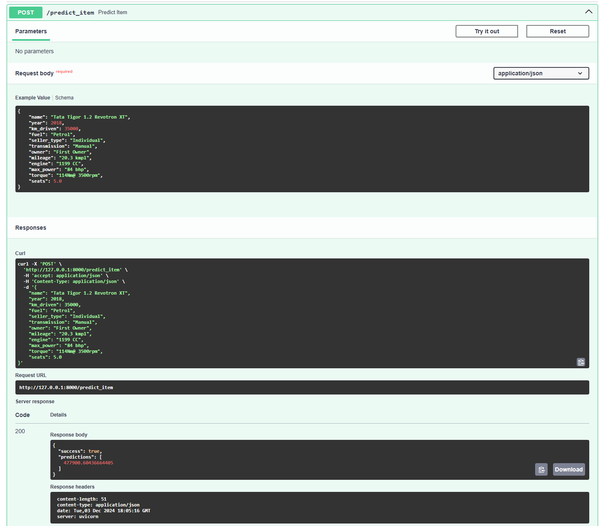
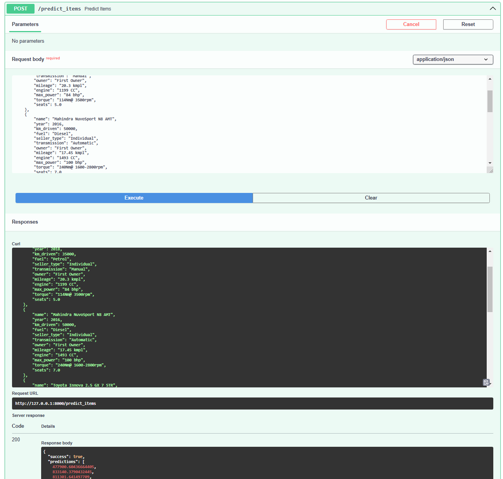
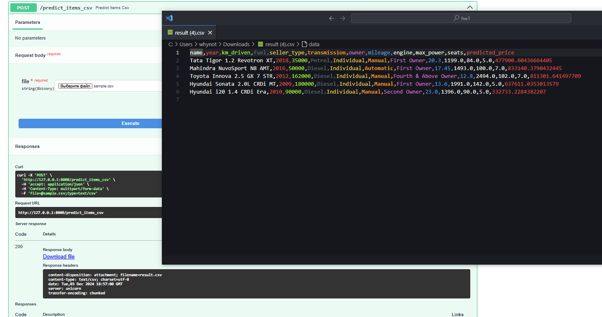

# AI HSE Homework 1

**Описание:** 
Выполнение домашнего задания связанного с линейными моделями и их инфернсом. 

## Что было сделано
Изначально, мы привели столбцы `mileage, engine, max_power` к числовому формату, убрав из него текстовые данные. 
В тестовых и тренировочных данных мы также заполнили пропуски медианой. Рассмотрели полученнные фичи и тестово обучили линейную регрессию на них. 

# Линейная регрессия
После обучения мы получили 
| Metric              | Value                  |
|---------------------|------------------------|
| **R² (R-Squared)**  | `0.5946593477102349`   |
| **MSE**             | `233001381697.27057`   |
| **Business Metric** | `0.224`               |

# Модели с регулиризацией
Добавляя к линейной регресии регулярицзацию мы не прибавили в качестве. 

# OneHotEncoding 
Мы начали работать с фичами, и категоризировали следующие фичи и закодировали их с помощью OneHotEncoding.
`fuel, seller_type, transmission, owner, seats`. 
После этого мы получили прирост в качестве модели: 
| Metric              | Value                  |
|---------------------|------------------------|
| **R² (R-Squared)**  | `0.6457514393785154`   |
| **MSE**             | `203632188439.04587`   |
| **Business Metric** | `0.247`               |
обучали и валидировали с помощью GridSearchCV

# Лучшая модель
Кодирование `name` и других категориальных фич привело к намного лучшем метрикам и получилась наша лучшая модель Ridge со следующими метриками: 
| Metric              | Value                  |
|---------------------|------------------------|
| **R² (R-Squared)**  | `0.7807144545530696`   |
| **MSE**             | `126051593361.64742`   |
| **Business Metric** | `0.305`               |

## FastAPI 
Для использования модели мы реализовали REST API с помощью FastApi. 

| Method | Endpoint            | Description                  |
|--------|---------------------|------------------------------|
| POST   | `/predict_item`     | Возвращает предпологаемую цену для машины в json|
| POST   | `/predict_items`    | Возвращает предпологаемую ценs для машин в json           |
| POST   | `/predict_items_csv`| На вход получает csv файл с машинами, на выходе тот же файл с дополнительной колонкой `predicted_price` |

# Демонстрация работы API 

Входные и выходные данные можно найти в [demo/](demo/)

## License

This project is licensed under the [MIT License](LICENSE).
